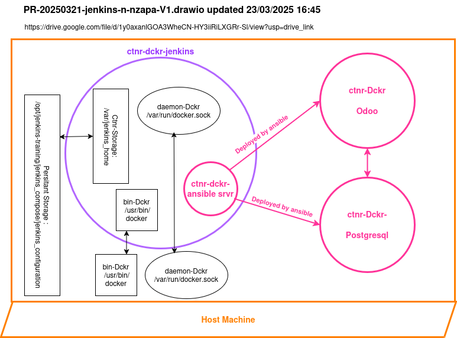

# jenkins-pipeline-ansible

## Objectives

1. Deploy a CI/CD pipeline of deployment of a server odoo.
1. Use jenkins, github, docker, ansible.

## Architecture



## To deploy

1. execute command docker-compose

```md
sudo docker-compose up -d

 ```

## Version

1. 23/03/2025 18:00 : Creation of sign up Github.
1. 24/03/2025 12:00 : Maj README.md et remplacement de 'master' par 'main'.
1. 24/03/2025 18:00 : Maj du mdp.
1. 24/03/2025 14:00 : Maj fichier ansible.cfg. Remplacer
\[defaults\] inventory:$PWD/inventory.yml par inventory:$PWD/hosts.yml.
et maj du fic hosts.yml pour configurer une connexion directe dckr au ctnr serveur_debian_test.
